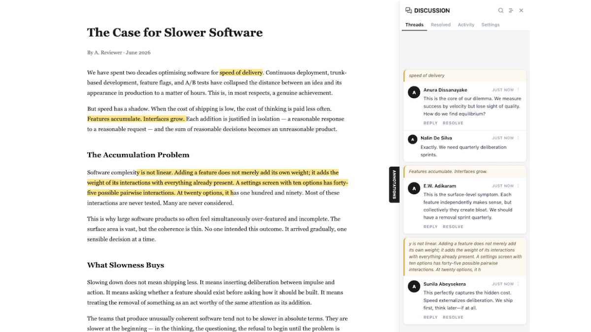

# Annotate.js

Lightweight inline annotation and threaded comments for any web page — added via a single `<script>` tag.



---

## Features

- **Select any text** → floating button → add a comment
- **Threaded replies** on every annotation
- **Resolve** threads when addressed
- **Offline-first** — works with no server; annotations persist in IndexedDB
- **Multi-tab sync** — BroadcastChannel keeps tabs on the same origin in sync instantly, zero deps
- **P2P sync** — optional `data-room-id` activates WebRTC peer-to-peer sync; no server needed; annotation content is DTLS-encrypted end-to-end
- **Multi-user sync** — optional Node.js + SQLite backend syncs annotations across browsers (30 s poll + tab-focus refresh)
- **Zero runtime dependencies** — one JS file; Trystero bundled at build time

---

## Sync modes

Annotate.js has four sync modes. Modes 1 and 2 are always active with zero configuration. Modes 3 and 4 are opt-in and mutually exclusive with each other.

| Mode | Activated by | Sync scope | Server needed? |
|---|---|---|---|
| **1 — Offline** | Default (no attributes needed) | Single browser, persists in IndexedDB | No |
| **2 — BroadcastChannel** | Automatic alongside Mode 1 | Same browser, multiple tabs, instant | No |
| **3 — Server sync** | `data-sync-url="https://…"` | Any browser, any device, durable | Yes (Node.js + SQLite) |
| **4 — P2P** | `data-room-id="<uuid>"` | Any browser, encrypted peer-to-peer | No (signaling relay only) |

### Mode 1 — Offline (default)
Annotations are saved to IndexedDB and survive page reloads. No network required. Works with the raw `annotate.js` source file — no build step needed. **Raw `annotate.js` supports Modes 1, 2, and 3 only. Mode 4 (P2P) requires `annotate.min.js`** — see [P2P sync requirements](#p2p-sync-no-server-required).

### Mode 2 — BroadcastChannel (automatic)
Layered on top of Mode 1 at zero cost. Any tabs open on the **same origin in the same browser** stay in sync instantly — no server, no WebRTC, no configuration. Uses the built-in [BroadcastChannel API](https://developer.mozilla.org/en-US/docs/Web/API/BroadcastChannel).

> Cross-browser (e.g. Firefox → Brave) is not possible via BroadcastChannel — that requires Mode 4.

### Mode 3 — Server sync
Activated by `data-sync-url`. Every mutation is pushed to a shared SQLite backend immediately and pulled back on page load, every 30 seconds, and on tab focus. Supports any number of concurrent users across any browser or device. Offline writes are queued (`dirty=true`) and flushed automatically on reconnect.

### Mode 4 — P2P (WebRTC)
Activated by `data-room-id`. Annotation content flows **directly browser-to-browser** over DTLS-encrypted WebRTC data channels — no server ever sees it. Uses a three-tier signaling fallback for the WebRTC handshake:

| Tier | Signaling method | Used when |
|---|---|---|
| **1** | Hosted Cloudflare relay (`wss://relay.annotate-js.workers.dev`) | Default — sub-second peer discovery |
| **2** | Self-hosted relay (`data-relay-url="wss://…"`) | Enterprise / air-gapped deployments |
| **3** | NOSTR public relays via [Trystero](https://github.com/dmotz/trystero) | Automatic fallback if Tiers 1 & 2 fail |

The fallback is automatic — if the relay WebSocket fails to connect within 5 seconds the client silently switches to NOSTR. Annotation data never passes through any relay regardless of tier.

> **Heads up:** the hosted relay (`wss://relay.annotate-js.workers.dev`) is not yet deployed. Until it is, Tier 3 (NOSTR) is the active path. A failed WebSocket connection to the relay URL and occasional NOSTR rate-limit warnings in the console are both expected and harmless — see [Troubleshooting](#troubleshooting).

---

## Quick start (offline, no server)

**Via jsDelivr CDN — no install, no server:**

```html
<!-- Always latest release -->
<script src="https://cdn.jsdelivr.net/gh/kasunben/Annotate.js@latest/annotate.min.js"
        data-site-id="my-site"></script>

<!-- Pin to a specific version (recommended for production) -->
<script src="https://cdn.jsdelivr.net/gh/kasunben/Annotate.js@v0.2.2/annotate.min.js"
        data-site-id="my-site"></script>
```

`annotate.min.js` is committed to the repo on every release, so jsDelivr serves it directly from the git tag — no build step needed on your end.

**Or load the raw source locally (offline + server-sync only — no P2P):**

```html
<script src="annotate.js" data-site-id="my-site"></script>
```

> **P2P requires `annotate.min.js`.** The raw source is a classic `<script>` tag and cannot use ES module imports, so Trystero (the NOSTR signaling library) is never available. If `data-room-id` is set on the raw source, all signaling tiers fail silently and annotations save to local IDB only — nothing reaches other peers. Always use `annotate.min.js` (CDN or locally built) for P2P mode.

In all cases, annotations are stored in IndexedDB and survive page reloads.

---

## Multi-user sync

### 1. Check Node.js version

```bash
node --version
# Node.js >= 23 required
```

The server uses the built-in `node:sqlite` module, which is not available in earlier versions.
[Download Node.js](https://nodejs.org/) if you need to upgrade.

### 2. Install and start the server

```bash
npm install
npm start
# → http://localhost:3000
```

### 3. Add `data-sync-url` to your script tag

```html
<!-- Remove data-sync-url to go back to offline-only mode -->
<script src="annotate.js"
        data-site-id="my-site"
        data-sync-url="http://localhost:3000"></script>
```

Two demo pages are available:

- **`http://localhost:3000/demo/demo.html`** — Offline-only (IndexedDB, no server)
- **`http://localhost:3000/demo/demo-sync-with-server.html`** — Multi-user sync enabled

To test multi-user sync, open the second URL in two browser windows and annotate — changes appear in both within 30 seconds, or immediately on tab focus.

---

## P2P sync (no server required)

> **Requirements:** P2P mode requires `annotate.min.js` (CDN or locally built via `npm run build`). The raw source file `assets/js/annotate.js` does **not** support P2P — see [Troubleshooting](#raw-source-annotate-js--p2p-doesnt-work) for details.

Add `data-room-id` to the script tag instead of `data-sync-url`:

```html
<script
  src="https://cdn.jsdelivr.net/gh/kasunben/Annotate.js@latest/annotate.min.js"
  data-site-id="my-site"
  data-room-id="f3a9c271-8d4e-4b1a-9c3f-d17b2e5a08cc">
</script>
```

**Use a long random UUID** — it's the shared secret. Anyone who knows the room ID on the same `pageUrl` can read and write all annotations.

### How P2P sync works

```
Browser A                  Relay (signaling only)          Browser B
────────────────────────────────────────────────────────────────────────
 joinRoom(roomId) ─────── WebSocket handshake ──────────── joinRoom(roomId)
                            (only room name visible)
                  ◄──────── DTLS-encrypted WebRTC ────────►
  User A adds thread
    → save to IDB
    → broadcastThread() ──────────────────────────────────► onPeerThread()
                                                              → merge by updatedAt
                                                              → save to IDB
                                                              → re-render card
```

- Annotation content **never** passes through any relay — only the WebRTC handshake (SDP + ICE)
- Three-tier signaling fallback: hosted relay → self-hosted relay (`data-relay-url`) → NOSTR via Trystero (automatic, ~5–15 s discovery)
- Last-write-wins by `updatedAt` — same conflict model as server sync
- See [Sync modes](#sync-modes) for the full tier table and when each is used

### Tradeoffs vs server sync

| | Server sync | P2P |
|---|---|---|
| Persistence | SQLite — survives all browsers closing | IDB only — latecomers see peer state when a peer is online |
| Privacy | Annotations on your server | Annotation content never leaves the browser |
| Hosting cost | VPS / container | Zero (annotation data); relay is a free Cloudflare Workers app |
| Offline writes | `dirty` flag, flushed on reconnect | Broadcast when a peer comes online |
| Activity history | Server-persisted | Broadcast only — latecomers miss offline events |

P2P is ideal for **live collaborative review sessions**. For async annotation over days, server sync provides better durability.

### Access control in P2P mode

Each browser has a persistent UUID (`annotate_author_id` in `localStorage`) attached to every thread and reply. Edit and Delete buttons are only shown to the browser that created the item — other users see the thread but cannot modify it. Anyone can mark a thread Resolved (collaborative action). The Settings tab does not show a "Clear" button in P2P mode — bulk-wiping local state while peers are online would leave the room inconsistent.

---

## How server sync works

```
Browser A                          Server                      Browser B
─────────────────────────────────────────────────────────────────────────
Select text → add comment
  └─ save to IndexedDB
  └─ POST /threads ──────────────► store in SQLite
                                                          30s poll fires
                                   GET /threads?since=T ◄─────────────
                                        └─ return new threads ─────────►
                                                          new card appears
```

- **Every mutation** (create, reply, edit, resolve, delete) is pushed to the server immediately
- **Incremental pulls** use a `?since=` timestamp so only changed threads travel the wire
- **Offline edits** are flagged `dirty=true` in IndexedDB and flushed to the server on next load
- **Conflict resolution** is last-write-wins by `updatedAt` — server wins for non-dirty local records

---

## Project structure

```
Annotate.js/
├── assets/
│   ├── js/annotate.js               # Client library source — single IIFE; no imports (loads as plain script)
│   └── js/trystero-shim.js          # esbuild --inject shim; wires Trystero into the bundle at build time
├── annotate.min.js                  # Production build — committed to repo; served via jsDelivr CDN
├── demo/
│   ├── demo.html                    # Offline-only test page
│   ├── demo-sync-with-server.html   # Multi-user sync test page (data-sync-url set)
│   └── demo-p2p.html                # P2P test page (data-room-id set, no server needed)
├── relay/
│   ├── worker.js                    # Cloudflare Worker + Durable Object WebSocket relay
│   └── wrangler.toml                # Wrangler deploy config
├── server/
│   ├── index.js                     # Express entry point; also serves static files
│   ├── db.js                        # SQLite schema + rowToThread/threadToRow helpers
│   ├── routes/threads.js            # Thread REST endpoints
│   ├── routes/activity.js           # Activity REST endpoints
│   └── data/                        # annotate.db lives here (gitignored)
├── Dockerfile                       # Multi-stage build → lean production image
├── docker-compose.yml               # Named volume for SQLite persistence
├── ecosystem.config.js              # PM2 config (instances: 1 — SQLite single-writer)
├── .nvmrc                           # Pins Node 23
├── package.json
└── docs/
    ├── screenshot.png               
    ├── annotate-js-concept.md       # Phase 1 spec & architecture decisions
    ├── rfc-p2p-sync.md             # P2P architecture RFC
    └── sync-modes.md               # All four sync modes — overview, embed examples, tradeoffs
```

---

## npm scripts

| Script | Description |
|--------|-------------|
| `npm run build` | Bundle + minify via esbuild → `annotate.min.js` (Trystero bundled in) |
| `npm start` | Start the server on port 3000 |
| `npm run kill-port` | Free port 3000 if already in use |
| `npm run pm2:start` | Start with PM2 (requires `npm i -g pm2`) |
| `npm run pm2:restart` | Restart the PM2 process |
| `npm run pm2:stop` | Stop the PM2 process |
| `npm run pm2:logs` | Tail PM2 logs |

---

## REST API

| Method | Path | Description |
|--------|------|-------------|
| `GET` | `/threads?siteId=&pageUrl=[&since=]` | Fetch threads; `since` for incremental pull |
| `POST` | `/threads` | Upsert a thread |
| `PATCH` | `/threads/:id` | Edit body |
| `PATCH` | `/threads/:id/resolve` | Resolve thread |
| `DELETE` | `/threads/:id` | Soft-delete thread |
| `POST` | `/threads/:id/replies` | Add reply |
| `PATCH` | `/threads/:id/replies/:replyId` | Edit reply |
| `DELETE` | `/threads/:id/replies/:replyId` | Soft-delete reply |
| `DELETE` | `/threads?siteId=[&authorId=]` | Delete threads for a site; scoped to `authorId` when provided (Settings → Clear my annotations); unscoped = admin delete-all |
| `GET` | `/activity?siteId=&pageUrl=[&since=]` | Fetch activity for page; `since` for incremental pull |
| `POST` | `/activity` | Push one activity entry (`INSERT OR IGNORE` — entries are immutable) |
| `DELETE` | `/activity?siteId=` | Hard-delete all activity for a site (Settings → Clear all) |

---

## Sidebar tabs

| Tab | Content |
|-----|---------|
| **Threads** | Active annotations for the current page |
| **Resolved** | Resolved annotations (read-only) |
| **Activity** | Shared event feed — all users' creates, replies, edits, resolves, deletes |
| **Settings** | Display name · "Clear all annotations" (offline/BC mode only); hidden in server-sync and P2P modes |

---

## Data model

```js
Thread {
  id, siteId, pageUrl,
  quote,          // snapshot of selected text
  anchor,         // { xpath, startOffset, endOffset } — survives page reload
  body, author, createdAt, updatedAt,
  resolved, resolvedAt, resolvedBy,
  replies: [{ id, body, author, createdAt, updatedAt, deleted }],
  dirty,          // true = not yet synced (client-only, never sent to server)
  deletedAt,      // soft-delete
}
```

---

## Testing

No automated test suite. Three demo pages available after `npm start`:

| Page | URL | Use for |
|------|-----|---------|
| Offline | `http://localhost:3000/demo/demo.html` | IDB-only testing, no server needed |
| Sync | `http://localhost:3000/demo/demo-sync-with-server.html` | Multi-user sync — open in two windows |
| P2P | `http://localhost:3000/demo/demo-p2p.html` | P2P sync — open in two browsers or incognito windows |

**Core checklist** (use either demo page):
- [ ] Select text → comment button appears
- [ ] Add thread → highlight + card appear in sidebar
- [ ] Reload → threads and highlights restored
- [ ] Edit / delete / resolve persist across reload
- [ ] Replies persist across reload
- [ ] Resolved tab shows resolved threads
- [ ] Activity tab shows all events
- [ ] Settings → "Clear all annotations" (offline only) → sidebar empties, stays empty after reload; button absent in server-sync and P2P modes

**Sync checklist** (use `demo-sync-with-server.html` in two windows):
- [ ] User A annotates → User B sees it within 30 s (or on tab focus)
- [ ] User A resolves → User B's card dims within 30 s
- [ ] User A deletes → User B's highlight unwraps within 30 s
- [ ] Kill server → User A can still annotate (offline mode, `dirty=true`)
- [ ] Restart server → User A's offline annotations push automatically
- [ ] User A annotates → User B's Activity tab shows `thread_created` within 30 s
- [ ] User A resolves → User B's Activity tab shows `thread_resolved` within 30 s
- [ ] Settings → "Clear my annotations" on User A → only User A's threads gone; User B's threads remain
- [ ] User A's activity tab empties on next pull for User B

---

## Troubleshooting

### Port 3000 already in use

If the server won't start because port 3000 is already occupied:

```bash
# Find the process using port 3000
lsof -nP -iTCP:3000 -sTCP:LISTEN

# Kill it by PID (replace 12345 with the actual PID)
kill -9 12345
```

Or use the npm script:
```bash
npm run kill-port
```

### Expected console warnings in P2P mode

When using `demo-p2p.html` (or any `data-room-id` embed) before the hosted relay is deployed, you will see:

```
WebSocket connection to 'wss://relay.annotate-js.workers.dev/room/…' failed
Annotate.js P2P: relay disconnected — falling back to NOSTR
Trystero: relay failure from wss://relay.damus.io/ — rate-limited: you are noting too much
```

All three are **expected and harmless**:

| Warning | Cause | Impact |
|---|---|---|
| WebSocket connection failed | Hosted relay not yet deployed | None — 5 s fallback to NOSTR fires automatically |
| Relay disconnected — falling back to NOSTR | Tier 1 failed, Tier 3 activating | None — P2P works via NOSTR |
| Trystero rate-limited from relay.damus.io | NOSTR relay throttles rapid reconnects during testing | None — Trystero tries its other 7+ relays |

P2P will still work. The warnings disappear once the hosted Cloudflare relay is deployed (see [Roadmap](#roadmap)).

### Raw source (`annotate.js`) + P2P doesn't work

**Symptom:** You changed the `<script src>` to `assets/js/annotate.js` in `demo-p2p.html`. Annotations save locally but never appear in the other browser. The console shows:
```
Annotate.js P2P: data-room-id is set but Trystero is not available. P2P mode requires the bundled build…
```

**Cause:** The raw source is a classic `<script>` tag and cannot `import` ES modules. Trystero (the NOSTR signaling library) is only available in `annotate.min.js` — it is injected at build time by esbuild via `--inject:assets/js/trystero-shim.js`. Without Trystero, the NOSTR fallback (Tier 3) is a no-op, and the hosted relay (Tier 1) is not yet deployed, so all signaling paths fail.

**Fix:** Use `annotate.min.js` for P2P. Either serve it locally after `npm run build`, or use the jsDelivr CDN. The raw source is for Modes 1–3 (offline + server sync) only.

---

## Self-hosting

Anyone can clone this repo, build the minified library, and deploy the server.

### 1. Build the minified library

```bash
git clone https://github.com/kasunben/Annotate.js
npm install
npm run build   # → annotate.min.js
```

### 2a. Deploy with Docker (recommended for PaaS / containerized VPS)

The image is published to GitHub Container Registry on every version tag:

```bash
# Pull the pre-built image and start (no build step needed)
docker compose pull && docker compose up -d
```

Or build locally from source (useful during development):

```bash
# Edit docker-compose.yml: remove the image: line, keep build: .
docker compose up -d --build
```

The `docker-compose.yml` mounts a named volume at `/app/server/data` so the SQLite database
persists across container restarts. Override the port with `PORT=8080 docker compose up -d`.

Works on any Docker host: DigitalOcean, Hetzner, Fly.io, Railway, Render, etc.

### 2b. Deploy with PM2 (bare-metal VPS)

```bash
npm install -g pm2
npm run pm2:start
pm2 save && pm2 startup   # survive server reboots
```

**Note:** `ecosystem.config.js` sets `instances: 1`. Do not increase this — `node:sqlite` holds a
write lock on the database; multiple instances deadlock on writes.

### 3. Embed on any page

Point `src` at your deployed server and you're done:

```html
<script
  src="https://your-server.example.com/annotate.min.js"
  data-site-id="my-site"
  data-sync-url="https://your-server.example.com">
</script>
```

---

## Roadmap

- [ ] Deploy hosted relay to `wss://relay.annotate-js.workers.dev` (relay code in `relay/` is ready)
- [ ] User account registration + annotation profile management (Milestone 2)

**Shipped:**
- [x] Ownership-based access control — Edit/Delete gated per browser; Resolve open to all; offline mode unrestricted
